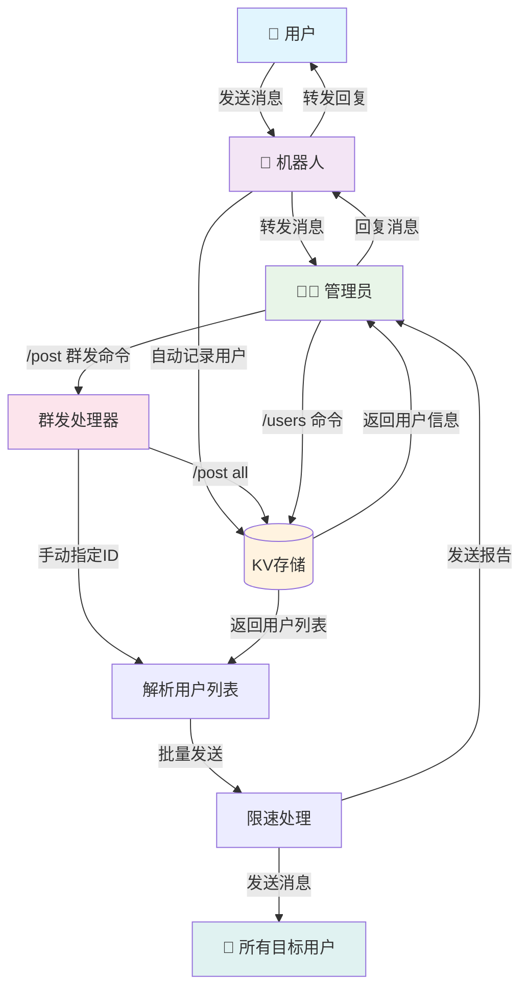
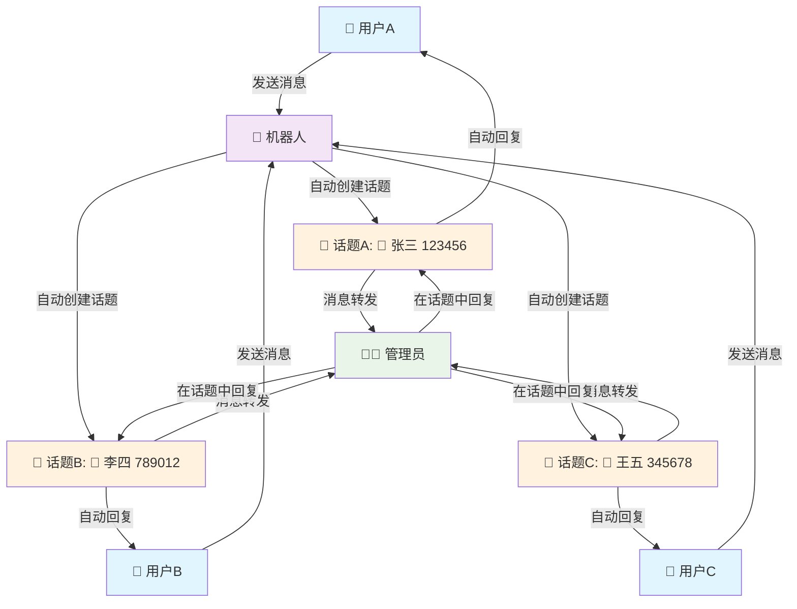

# 📱 cftgsx - Cloudflare-Telegram 双向Bot

## 🚀 高性能无状态双向消息转发解决方案

<div align="center">


**基于Cloudflare Workers的Telegram消息转发机器人**

[快速开始](#quick-start) • [使用方法](#usage) • [部署步骤](#deployment) • [贡献指南](#contributing)

</div>

## 📸 项目演示

<div align="center">

### 🔄 完整功能流程



### ✨ 功能特色

| 🚀 高性能 | 🛡️ 可靠性 | 🧹 简洁性 |
|:---:|:---:|:---:|
| 毫秒级响应 | 99.9%可用性 | 单文件部署 |
| 后台处理 | 自动重试 | 零配置启动 |
| 无状态设计 | 错误监控 | 易于维护 |

</div>

---

## 🌟 项目亮点

这是一个基于**Cloudflare Workers**的高性能Telegram双向消息转发机器人，采用无状态设计，支持用户消息转发给管理员，管理员直接回复，以及**强大的群发消息功能**。**新增论坛话题模式支持**，为每个用户创建独立话题，提供更好的消息管理体验。

### ⭐ 为什么选择这个项目？

- 🚀 **一键部署** - 支持Deploy按钮快速部署到Cloudflare Workers
- 🔥 **零成本部署** - 基于Cloudflare Workers免费额度
- ⚡ **极速响应** - 后台处理，毫秒级响应
- 🛡️ **高可靠性** - 完善错误处理，自动监控
- 🧹 **代码简洁** - 函数式架构，易于维护
- 📦 **开箱即用** - 单文件部署，配置简单
- 🗣️ **论坛模式** - 支持Telegram论坛群组，每个用户独立话题

## 📋 功能特性

<table>
<tr>
<td width="50%">

**🔄 核心功能**
- ✅ 双向消息转发
- ✅ 多媒体消息支持
- ✅ 用户信息展示
- ✅ 即时确认回复
- ✅ **群发消息功能**
- ✅ **用户跟踪管理**
- ✅ **论坛话题模式**

</td>
<td width="50%">

**⚡ 技术特性**
- ✅ 无状态设计
- ✅ 后台异步处理
- ✅ 完善错误监控
- ✅ 安全验证机制
- ✅ **可选KV存储支持**
- ✅ **批量处理与限速**
- ✅ **论坛话题自动管理**

</td>
</tr>
</table>

### 🗣️ 论坛模式特性

<div align="center">

**将普通群组转换为专业的客服论坛**



</div>

**🎯 论坛模式优势**

| 特性 | 传统模式 | 论坛模式 |
|:---:|:---:|:---:|
| 消息组织 | 混合在一起 | 📝 每个用户独立话题 |
| 回复方式 | 需要回复特定消息 | 💬 直接在话题中发送 |
| 消息历史 | 难以追踪 | 📚 完整的对话历史 |
| 多管理员 | 容易混乱 | 👥 清晰的分工协作 |
| 用户体验 | 基础功能 | 🌟 专业客服体验 |

**🛠️ 论坛模式配置**

1. **创建论坛群组**
   - 在Telegram中创建新群组
   - 进入群组设置 → 群组类型 → 选择"论坛"

2. **配置机器人**
   - 将机器人添加到论坛群组
   - 设置环境变量 `ENABLE_FORUM_MODE=true`
   - 确保机器人有创建话题的权限

3. **自动功能**
   - 🚀 用户首次发送消息时自动创建话题
   - 🎨 随机分配话题图标颜色
   - 📝 话题名称格式：`💬 用户名 (用户ID)`
   - 🔄 所有后续消息自动路由到对应话题

### 💬 使用场景

- 📞 **客服系统** - 个人/小团队客服消息处理
- 🔗 **消息中转** - 不同用户群体间的消息桥接  
- 📱 **通知转发** - 将系统通知转发到个人聊天
- 🤖 **Bot集成** - 作为其他系统的消息接口
- 🗣️ **论坛管理** - 在论坛群组中为每个用户管理独立话题

<a id="quick-start"></a>
## 🚀 快速开始

### 🚀 一键部署

<div align="center">

[](https://deploy.workers.cloudflare.com/?url=https://github.com/SCSHIRKER/cftgsx)

**[点击上方按钮一键部署到Cloudflare Workers](https://deploy.workers.cloudflare.com/?url=https://github.com/SCSHIRKER/cftgsx)**

</div>

> 🎯 **超简单部署**: 只需点击按钮，Fork仓库，配置环境变量即可完成部署！

#### 🔥 一键部署步骤

<details>
<summary><strong>📱 点击展开一键部署详细说明</strong></summary>

**第1步: 准备Telegram机器人**
1. 向 [@BotFather](https://t.me/BotFather) 发送 `/newbot` 创建机器人
2. 记录获得的 `Bot Token`
3. 向 [@userinfobot](https://t.me/userinfobot) 发送消息获取你的 `Chat ID`

**第2步: 一键部署**
1. 点击上方 "Deploy to Cloudflare Workers" 按钮
2. 授权Cloudflare访问你的GitHub账号
3. Fork本仓库到你的GitHub账号
4. 在Cloudflare Workers中创建新的应用

**第3步: 配置环境变量**
在Cloudflare Workers控制台中设置以下环境变量：
```bash
BOT_TOKEN=1234567890:AAAA-BBBBBBBBBBBBBBBBBBBBBBBBBB
ADMIN_CHAT_ID=123456789
WEBHOOK_SECRET=your-random-secret-key
USER_ID_SECRET=your-user-id-secret-key
ENABLE_USER_TRACKING=true
ENABLE_FORUM_MODE=true  # 启用论坛话题模式（可选）
```

**第4步: 设置Webhook**
访问: `https://your-app-name.your-subdomain.workers.dev/setWebhook`

**第5步: 开始使用**
向你的机器人发送消息测试功能！

</details>

#### 🛠️ 使用Wrangler CLI部署

<details>
<summary><strong>💻 点击展开CLI部署方法</strong></summary>

**前置要求**: 
- 安装 [Node.js](https://nodejs.org/) 
- 拥有 [Cloudflare账号](https://dash.cloudflare.com/sign-up)

**快速部署**:
```bash
# 1. 克隆仓库
git clone https://github.com/SCSHIRKER/cftgsx.git
cd cftgsx

# 2. 安装Wrangler CLI
npm install -g wrangler

# 3. 登录Cloudflare
wrangler auth login

# 4. 配置wrangler.toml
# 编辑wrangler.toml，取消KV存储注释（如需要）

# 5. 创建KV存储（可选）
wrangler kv:namespace create "USER_STORAGE"
wrangler kv:namespace create "USER_STORAGE" --preview

# 6. 设置环境变量
wrangler secret put BOT_TOKEN
wrangler secret put ADMIN_CHAT_ID
wrangler secret put WEBHOOK_SECRET
wrangler secret put USER_ID_SECRET

# 7. 部署
wrangler deploy

# 8. 设置Webhook
curl https://your-worker.your-subdomain.workers.dev/setWebhook

# 或者使用npm脚本（更方便）
npm run deploy          # 部署到默认环境
npm run deploy:prod     # 部署到生产环境
npm run dev             # 本地开发模式
npm run webhook:set     # 设置Webhook（需要先修改URL）
npm run status          # 检查服务状态
```

#### 📋 可用的npm脚本命令

项目包含多个便捷的npm脚本命令：

| 命令 | 功能 | 说明 |
|------|------|------|
| `npm run deploy` | 部署到默认环境 | 等同于 `wrangler deploy` |
| `npm run deploy:prod` | 部署到生产环境 | 使用production配置部署 |
| `npm run deploy:dev` | 部署到开发环境 | 使用development配置部署 |
| `npm run dev` | 本地开发模式 | 启动本地开发服务器 |
| `npm run login` | 登录Cloudflare | 等同于 `wrangler auth login` |
| `npm run kv:create` | 创建KV存储空间 | 创建生产环境KV |
| `npm run kv:create:preview` | 创建预览KV空间 | 创建预览环境KV |
| `npm run webhook:set` | 设置Webhook | 需要先修改URL |
| `npm run status` | 检查服务状态 | 健康检查 |
| `npm run bot:info` | 获取机器人信息 | 查看机器人详情 |

</details>


### 📋 前置要求

- [Cloudflare账号](https://dash.cloudflare.com/sign-up) (免费)
- [Telegram Bot Token](https://t.me/BotFather) 
- 管理员的Telegram Chat ID

### ⚡ 手动部署

1. **获取Bot Token**
   ```bash
   # 1. 在Telegram中找到 @BotFather
   # 2. 发送 /newbot 创建机器人
   # 3. 记录返回的Bot Token
   ```

2. **获取Chat ID**
   ```bash
   # 方法1: 使用 @userinfobot 获取你的Chat ID
   # 方法2: 发消息给bot后访问 https://api.telegram.org/bot<TOKEN>/getUpdates
   ```

3. **部署到Cloudflare**
   - 复制 `worker.js` 内容到Cloudflare Workers编辑器
   - 设置环境变量 (见下方配置)
   - 访问 `/setWebhook` 端点完成配置

就是这么简单！🎉

<a id="deployment"></a>
## 🛠️ 部署步骤

### 步骤1: 创建Telegram机器人

<details>
<summary>📱 点击展开详细步骤</summary>

1. 在Telegram中搜索 `@BotFather`
2. 发送 `/newbot` 命令
3. 按提示设置机器人名称和用户名
4. 保存返回的Bot Token

```
示例输出:
Use this token to access the HTTP API:
1234567890:AAAA-BBBBBBBBBBBBBBBBBBBBBBBBBB
```

</details>

### 步骤2: 获取管理员Chat ID

<details>
<summary>🆔 点击展开获取方法</summary>

**方法1 (推荐)**: 使用 @userinfobot
```
1. 在Telegram中搜索 @userinfobot
2. 发送 /start
3. 记录显示的Chat ID
```

**方法2**: 通过API获取
```
1. 向你的机器人发送任意消息
2. 访问: https://api.telegram.org/bot<YOUR_BOT_TOKEN>/getUpdates
3. 在返回的JSON中找到 "chat":{"id": 123456789}
```

</details>

### 步骤3: 部署到Cloudflare Workers

<details>
<summary>☁️ 点击展开部署步骤</summary>

1. **创建Worker**
   - 访问 [Cloudflare Workers](https://workers.cloudflare.com/)
   - 点击 "Create a Service"
   - 输入服务名称（如：`telegram-bot`）

2. **配置代码**
   - 删除默认代码
   - 复制粘贴 [`worker.js`](./worker.js) 的全部内容
   - 点击 "Save and Deploy"

3. **设置环境变量**
   
   在Worker设置页面添加以下环境变量：

   | 变量名 | 说明 | 是否必需 | 示例值 |
   |:------|:-----|:---------|:-------|
   | `BOT_TOKEN` | Telegram Bot Token | ✅ | `1234567890:AAAA-BBBB...` |
   | `ADMIN_CHAT_ID` | 管理员Chat ID | ✅ | `123456789` |
   | `WEBHOOK_SECRET` | Webhook验证密钥 | ⚠️ 推荐 | `your-secret-key` |
   | `ENABLE_USER_TRACKING` | 启用用户跟踪 | ❌ 可选 | `true` |
   | `USER_ID_SECRET` | 用户ID签名密钥 | ⚠️ 推荐 | `your-security-key` |
   | `ENABLE_FORUM_MODE` | 启用论坛话题模式 | ❌ 可选 | `true` |

   > 🔐 **安全提示**: 
   > - `USER_ID_SECRET` 用于防止用户身份伪造攻击，强烈建议设置
   > - `WEBHOOK_SECRET` 用于验证Webhook请求来源
   > - 密钥应使用随机生成的强密码

4. **绑定KV存储** (可选，用于用户跟踪)
   ```bash
   # 如果需要用户跟踪功能
   # 1. 在Cloudflare创建KV命名空间
   # 2. 在Worker设置中绑定变量名: USER_STORAGE
   # 3. 设置环境变量: ENABLE_USER_TRACKING=true
   ```

5. **设置Webhook**
   ```bash
   # 访问这个URL完成设置
   https://your-worker.your-subdomain.workers.dev/setWebhook
   ```

✅ **成功响应示例**:
```json
{
  "ok": true,
  "result": true,
  "description": "Webhook was set"
}
```

</details>

### 🗄️ 可选：配置KV存储（群发功能）

<details>
<summary>📦 点击展开KV存储配置步骤</summary>

如需使用群发功能中的`/post all`命令，需要配置KV存储来跟踪用户：

1. **创建KV存储空间**
   - 在Cloudflare控制台进入 "Workers" → "KV"
   - 点击 "Create a Namespace"
   - 命名为 `USER_STORAGE`

2. **绑定到Worker**
   - 在Worker设置页面，找到 "Variables" 部分
   - 点击 "Add binding"
   - 类型选择 "KV Namespace"
   - 变量名：`USER_STORAGE`
   - KV namespace：选择刚创建的空间

3. **启用用户跟踪**
   - 添加环境变量：`ENABLE_USER_TRACKING` = `true`

4. **验证配置**
   ```bash
   # 管理员发送命令验证
   /users                    # 应显示"暂无用户记录"
   /post all 测试消息        # 开始自动记录用户
   ```

</details>

### 🗣️ 可选：配置论坛话题模式

<details>
<summary>📝 点击展开论坛模式配置步骤</summary>

论坛话题模式为每个用户创建独立话题，提供更好的消息管理体验：

**功能特色：**
- 🎯 每个用户有独立话题
- 📝 话题名称显示用户信息
- 🎨 随机分配话题图标颜色
- 💬 支持话题内直接回复
- 🔄 自动维护用户-话题映射

**配置步骤：**

1. **设置论坛群组**
   - 创建新的群组或使用现有群组
   - 在群组设置中启用"话题"功能
   - 将机器人添加到群组并设为管理员

2. **获取群组ID**
   ```bash
   # 向群组发送消息，然后访问：
   https://your-worker.workers.dev/me
   # 查看最近的updates获取群组ID
   ```

3. **配置环境变量**
   ```bash
   ADMIN_CHAT_ID=-1001234567890  # 群组ID（负数）
   ENABLE_FORUM_MODE=true        # 启用论坛模式
   ENABLE_USER_TRACKING=true     # 论坛模式需要用户跟踪
   ```

4. **验证配置**
   - 用户发送消息后，机器人会自动创建对应话题
   - 管理员可以在话题中直接回复用户
   - 使用 `/status` 查看论坛模式状态

**注意事项：**
- 论坛模式需要 KV 存储支持
- 管理员聊天必须是论坛群组
- 机器人需要管理员权限以创建话题

</details>

### 🎉 完成！

现在你的机器人已经可以正常工作了：
- 用户发送消息会自动转发给管理员
- 管理员回复转发的消息即可回复给用户
- **管理员可使用`/post`命令进行消息群发**

<a id="usage"></a>
## 📖 使用方法

### 👤 用户端操作

```bash
/start                    # 开始对话，显示欢迎信息
发送任意消息               # 自动转发给管理员
等待管理员回复             # 收到管理员的回复消息
```

### 👨‍💼 管理员操作

```bash
/start                    # 显示管理员控制面板
/status                   # 查看机器人运行状态  
/help                     # 获取帮助信息
/users                    # 查看用户列表（需启用用户跟踪）
回复转发的消息             # 直接回复给对应用户

# 📢 群发功能
/post all 消息内容        # 向所有用户群发（需启用用户跟踪）
/post 123,456,789 消息内容 # 向指定用户群发
回复媒体+/post命令        # 群发媒体消息

# 🗣️ 论坛模式操作（启用论坛模式时）
在用户话题中直接发送消息    # 直接回复给对应用户
回复话题中的消息           # 回复给对应用户
查看话题列表              # 每个话题对应一个用户
```

### 🤖 机器人命令

| 命令 | 适用对象 | 功能描述 |
|------|---------|----------|
| `/start` | 全部 | 显示欢迎信息或管理面板 |
| `/status` | 管理员 | 查看机器人运行状态 |
| `/help` | 管理员 | 显示详细帮助信息 |
| `/post` | 管理员 | **群发消息功能** |
| `/users` | 管理员 | **查看用户列表** |

## 📁 项目结构

```
cftgsx/
├── 📄 worker.js                 # 主程序文件 (单文件部署)
├── 📄 package.json              # 项目配置和脚本命令
├── 📄 wrangler.toml             # Cloudflare Workers配置文件
├── 📄 deploy-config.example.json # 部署配置示例文件
├── 📄 README.md                 # 项目说明文档
├── 📄 LICENSE                   # MIT开源协议
└── 📄 .gitignore               # Git忽略文件
```

## 🔧 API端点

| 端点 | 方法 | 描述 |
|------|------|------|
| `/webhook` | POST | Telegram Webhook接收端点 |
| `/setWebhook` | GET | 设置Telegram Webhook |
| `/me` | GET | 获取机器人信息 |
| `/` | GET | 健康检查 |

## 🛡️ 安全说明

### 🔐 身份验证安全

本项目已实现**用户身份伪造防护**机制，确保消息转发的安全性：

#### 🚨 安全风险（已修复）
- **身份伪造攻击**: 恶意用户曾可通过在消息中插入 `[USER:其他用户ID]` 来伪造身份
- **影响**: 管理员回复可能被错误发送给其他用户

#### ✅ 安全措施
1. **加密签名验证**
   - 用户标识采用 `[USER:id:signature]` 格式
   - 使用HMAC-SHA256生成不可伪造的签名
   - 自动验证签名有效性

2. **环境变量保护**
   ```bash
   USER_ID_SECRET=your-random-secret-key  # 签名密钥
   WEBHOOK_SECRET=your-webhook-secret     # Webhook验证
   ```

3. **向后兼容**
   - 支持旧格式标识符（仅在无新格式时使用）
   - 自动迁移到安全格式
   - 记录安全警告日志

#### 🔧 安全配置建议

1. **设置强密钥**
   ```bash
   # 生成随机密钥示例
   openssl rand -hex 32  # 用于 USER_ID_SECRET
   openssl rand -hex 16  # 用于 WEBHOOK_SECRET
   ```

2. **监控安全日志**
   - 查看Cloudflare Workers日志
   - 关注"检测到无效的用户ID签名"警告
   - 监控"使用了不安全的旧格式"提示

3. **最佳实践**
   - 定期更换密钥
   - 启用Webhook验证
   - 限制管理员访问权限

> ⚠️ **重要提醒**: 如果不设置 `USER_ID_SECRET`，系统将使用后备哈希机制，安全性相对较低。强烈建议配置此环境变量。

## 🧪 测试验证

### ✅ 基本功能测试

<details>
<summary>点击查看测试步骤</summary>

1. **用户消息测试**
   ```bash
   用户: /start
   期望: 收到欢迎消息
   
   用户: 发送测试消息
   期望: 管理员收到转发消息
   ```

2. **管理员回复测试**
   ```bash
   管理员: 回复转发消息
   期望: 用户收到回复
   ```

3. **管理员命令测试**
   ```bash
   管理员: /status
   期望: 显示机器人状态
   
   管理员: /help
   期望: 显示帮助信息
   ```

4. **群发功能测试**（需配置KV存储）
   ```bash
   管理员: /users
   期望: 显示用户列表或"暂无用户记录"
   
   管理员: /post 123456789 测试群发
   期望: 指定用户收到广播消息
   
   管理员: /post all 全体通知
   期望: 所有用户收到广播消息
   ```

</details>

### 🔍 状态检查

| 检查项 | URL | 期望结果 |
|--------|-----|----------|
| 健康检查 | `https://your-worker.workers.dev/` | `Telegram Bot is running!` |
| 机器人信息 | `https://your-worker.workers.dev/me` | 返回机器人详细信息 |
| Webhook状态 | `https://your-worker.workers.dev/setWebhook` | `{"ok": true, ...}` |

## ❓ 常见问题

<details>
<summary><strong>Q: 机器人没有响应？</strong></summary>

**可能原因：**
- ❌ Bot Token错误或无效
- ❌ 环境变量设置不正确  
- ❌ Webhook未设置成功

**解决方案：**
1. 检查环境变量 `BOT_TOKEN` 是否正确
2. 访问 `/me` 端点验证Token有效性
3. 重新访问 `/setWebhook` 设置Webhook
4. 查看Worker日志确认错误信息

</details>

<details>
<summary><strong>Q: 管理员收不到用户消息？</strong></summary>

**可能原因：**
- ❌ `ADMIN_CHAT_ID` 设置错误
- ❌ 管理员未先与机器人对话

**解决方案：**
1. 确认 `ADMIN_CHAT_ID` 数值正确
2. 管理员先向机器人发送 `/start`
3. 检查Worker日志中的转发记录

</details>

<details>
<summary><strong>Q: 用户收不到管理员回复？</strong></summary>

**可能原因：**
- ❌ 管理员未回复带有用户标识的消息
- ❌ 用户ID解析失败

**解决方案：**
1. 确保回复的是转发消息，而非普通消息
2. 检查转发消息是否包含 `[USER:xxxxx]` 标识
3. 查看Worker日志确认回复发送状态

</details>

<details>
<summary><strong>Q: /post all 命令提示需要启用用户跟踪？</strong></summary>

**可能原因：**
- ❌ 未设置 `ENABLE_USER_TRACKING=true`
- ❌ 未配置KV存储绑定
- ❌ KV存储绑定变量名错误

**解决方案：**
1. 确认环境变量 `ENABLE_USER_TRACKING` 设置为 `true`
2. 检查KV存储绑定变量名为 `USER_STORAGE`
3. 确认至少有一个用户与机器人交互过
4. 查看Worker日志确认KV操作状态

</details>

<details>
<summary><strong>Q: 群发消息部分失败？</strong></summary>

**可能原因：**
- ❌ 部分用户阻止了机器人
- ❌ 用户ID无效或已删除账号
- ❌ 触发Telegram API限制

**解决方案：**
1. 查看群发报告中的错误详情
2. 群发会自动跳过无效用户，这是正常现象
3. 系统已内置限速机制，避免API限制
4. 如需群发大量用户，建议分批进行

</details>

### 📊 日志查看

在Cloudflare Workers控制台查看实时日志：
```
Workers → 你的Worker → Logs 标签
```

## ⚠️ 使用限制

### 技术限制

- **并发处理**: Cloudflare Workers免费版有并发限制 (1000 requests/min)
- **消息大小**: 受Telegram API限制（文件最大50MB）  
- **存储**: 无持久化存储，适合消息转发场景
- **功能**: 专注消息转发，不支持群聊管理等复杂功能

### 💡 解决方案

- **高并发**: 升级Cloudflare Workers套餐
- **大文件**: 使用文件压缩或分片上传
- **数据存储**: 集成KV存储实现持久化（如需要）

---

<a id="contributing"></a>
## 🤝 贡献指南

欢迎提交Issue和Pull Request！

### 🔧 开发环境设置

1. **克隆项目**
   ```bash
   git clone https://github.com/SCSHIRKER/cftgsx.git
   cd cftgsx
   ```

2. **本地测试**
   ```bash
   # 使用 Wrangler CLI 进行本地开发
   npm install -g wrangler
   wrangler dev
   ```

3. **代码风格**
   - 使用ES6+语法
   - 函数式编程优先
   - 添加适当的错误处理
   - 保持代码简洁明了

### 📝 提交规范

- 🐛 `fix:` 修复Bug
- ✨ `feat:` 新功能
- 📚 `docs:` 文档更新
- 🎨 `style:` 代码格式
- ♻️ `refactor:` 代码重构
- ⚡ `perf:` 性能优化
- 🧪 `test:` 测试相关

### 🚀 发布版本

项目采用最新的Cloudflare Workers最佳实践进行优化。

## 📝 更新日志

### v1.2.3 (Latest) - 🎨 用户链接排版优化
- 🔗 **修复链接渲染**: 移除等宽字体包装，确保用户链接可正常点击跳转
- 🎨 **优化显示格式**: 使用"📍 *来源:*"标签替代原反引号包装，提升消息可读性
- 💫 **改进用户体验**: 管理员现在可以直接点击用户链接查看用户信息或跳转对话
- 🔧 **技术细节**: 基于Telegram Markdown规范优化格式化，确保链接正确渲染

### v1.2.2 - 🔗 智能用户链接功能
- ✨ **智能用户链接**: 根据用户类型生成不同格式的可点击链接
  - 有username用户: `[@username (ID:signature)](https://t.me/username)` 
  - 无username用户: `[👤 USER:ID:signature](tg://user?id=ID)`
- 🎯 **优先显示username**: 有username的用户优先显示`@username`格式，更符合Telegram使用习惯
- 🛡️ **安全性保持**: 所有链接格式仍包含签名验证，确保安全性
- 🔄 **完全向后兼容**: 支持多种历史格式的用户标识解析
- 📱 **跨平台支持**: username链接使用web格式，在所有设备上都能正常工作
- 💾 **数据增强**: 用户信息存储中新增username字段，提升数据完整性

### v1.2.1 - 🛠️ Markdown解析错误修复
- 🐛 **修复Markdown解析错误**: 解决包含特殊字符的消息发送失败问题
- 🔧 **新增escapeMarkdown函数**: 自动转义Telegram Markdown特殊字符 (`*`, `_`, `[`, `]`, `(`, `)`, `~`, `` ` ``, `>`, `#`, `+`, `=`, `|`, `{`, `}`, `.`, `!`, `-`)
- 🛡️ **全面安全加固**: 对管理员回复、广播消息、用户caption、错误消息等6个关键位置进行转义处理
- ⚡ **改进sendMessage函数**: 支持自定义parse_mode选项，保持向后兼容性
- 📈 **提升稳定性**: 彻底解决"Bad Request: can't parse entities"错误
- 🎯 **用户体验优化**: 消息内容保持可读性的同时确保发送成功

### v1.2.0 - 🗣️ 论坛模式与代码质量优化
- ✨ **新增论坛话题模式**: 支持Telegram论坛群组，每个用户独立话题
- 🏗️ **架构重构**: 基于Cloudflare Workers最佳实践全面优化代码质量
- 🛡️ **安全增强**: 强化输入验证、错误处理和HMAC签名机制
- ⚡ **性能优化**: 添加API超时处理、重试机制和批量优化
- 🔧 **新增常量管理**: 统一配置管理，提高代码可维护性
- 📊 **日志系统**: 实现结构化日志记录，便于监控和调试
- 🗣️ **论坛功能**: 自动创建用户话题、随机图标色彩、话题内直接回复
- 🔍 **系统消息过滤**: 智能过滤创建话题等系统消息，避免误报
- 📚 **文档完善**: 详细的论坛模式配置指南和功能对比说明
- 🧪 **代码质量**: 添加输入验证、错误边界处理和API响应验证

### v1.1.1 
- 🛡️ **重要安全修复**: 修复用户身份伪造漏洞
- ✨ 新增加密签名验证机制 (HMAC-SHA256)
- 🔧 新增 `USER_ID_SECRET` 环境变量
- 🔒 用户标识格式升级为 `[USER:id:signature]`
- 📝 向后兼容旧格式标识符，自动迁移
- 📚 新增详细安全说明和配置指南
- ⚡ 优化安全日志和警告提示

### v1.1.0
- ✨ **新增群发消息功能**
- ✨ **新增用户跟踪管理**
- ✨ **新增KV存储支持**
- 🔧 新增 `/post` 命令支持文本和媒体群发
- 🔧 新增 `/users` 命令查看用户列表
- ⚡ 优化批量处理和自动限速
- 📚 完善文档和使用说明

### v1.0.0
- 🎉 首次发布
- ✨ 双向消息转发功能
- ⚡ 无状态高性能设计
- 🛡️ 完善错误处理机制
- 📦 单文件部署方案
- 🔧 管理员命令支持

### 🔮 计划中功能
- [ ] 群聊消息转发支持
- [ ] 消息过滤和规则配置
- [ ] 数据统计和分析面板
- [ ] 多管理员支持
- [ ] 消息模板和自动回复

## 📄 许可证

本项目采用 [MIT License](./LICENSE) 开源协议。

```
MIT License - 可自由使用、修改、分发
```

## 🙏 致谢

- 感谢 [Cloudflare Workers](https://workers.cloudflare.com/) 提供的优秀Serverless平台
- 感谢 [Telegram Bot API](https://core.telegram.org/bots/api) 的强大功能
- 感谢所有贡献者和使用者的支持

## 📞 支持

如果这个项目对你有帮助，请考虑：

- ⭐ 给项目加个Star
- 🐛 报告Bug或提出建议
- 📢 推荐给其他人
- 🤝 参与项目贡献

## 🔗 相关链接

- [Cloudflare Workers 文档](https://developers.cloudflare.com/workers/)
- [Telegram Bot API 文档](https://core.telegram.org/bots/api)
- [GitHub仓库](https://github.com/SCSHIRKER/cftgsx)

---

<div align="center">

**🤖 让消息转发变得简单高效！**

Made with ❤️ by developers, for developers.

</div> 